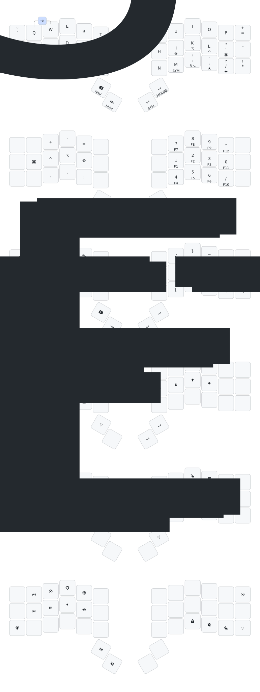

# ZSA Voyager QMK keymap

Custom QMK keymap for the ZSA Voyager, using the [external userspace](https://docs.qmk.fm/newbs_external_userspace) pattern. Uses mainline QMK firmware (not ZSA's fork) with ZSA-specific features pulled in as [community modules](https://github.com/zsa/qmk_modules). The firmware repo is cloned separately and never modified; this repo contains only the keymap and community modules.

## Setup

Prerequisites:

```fish
brew install qmk/qmk/qmk
brew install dos2unix
```

Clone mainline QMK firmware and init its submodules (ChibiOS, etc.):

```fish
qmk setup -H ~/<path-to>/qmk-firmware
cd ~/<path-to>/qmk-firmware
make git-submodule
```

Clone this repo with submodules (ZSA modules, getreuer modules):

```fish
git clone --recurse-submodules <this-repo> ~/<path-to>/qmk-keymap
```

Or if already cloned:

```fish
cd ~/<path-to>/qmk-keymap
git submodule update --init --recursive
```

Point QMK at both directories. On macOS the config lives at `~/Library/Application Support/qmk/qmk.ini`.

```fish
qmk config user.qmk_home=~/<path-to>/qmk-firmware
qmk config user.overlay_dir=~/<path-to>/qmk-keymap
```

The ARM and AVR compilers from Homebrew are keg-only and need to be on PATH. Add to `~/.config/fish/conf.d/qmk.fish`:

```fish
fish_add_path /opt/homebrew/opt/arm-none-eabi-gcc@8/bin
fish_add_path /opt/homebrew/opt/arm-none-eabi-binutils/bin
fish_add_path /opt/homebrew/opt/avr-gcc@8/bin
fish_add_path /opt/homebrew/opt/avr-binutils/bin
```

Verify with `qmk doctor`.

## Usage

Compile:

```fish
qmk compile -kb zsa/voyager -km alexkrupa
```

Compile with `--compiledb` to make LSP cross-file navigation work:

```fish
qmk compile --compiledb -kb zsa/voyager -km alexkrupa
```

Compile and flash:

```fish
qmk flash -kb zsa/voyager -km alexkrupa
```

Then enter bootloader mode: hold `-` (activates layer 5) and press the top-right key (`QK_BOOT`). Alternatively, press the physical reset button on the bottom of the left half.

Note: bare `make` does not work with external userspace. Always use `qmk compile` / `qmk flash`.

### Updating QMK firmware

```fish
cd ~/<path-to>/qmk-firmware
git pull
make git-submodule
```

Then rebuild.

## Where to change what

| I want to... | File | What to edit |
|---|---|---|
| Change key positions / layers | `keymap.c` | `keymaps[]` array |
| Add custom shift mappings | `keymap.c` | `custom_shift_keys[]` array |
| Add macros | `keymap.c` | `enum custom_keycodes` + `process_record_user()` |
| Tune tapping term per key | `keymap.c` | `get_tapping_term()` |
| Add/change combos | `keymap.c` | `combo` arrays + `key_combos[]` |
| Enable/disable QMK features | `rules.mk` | e.g. `COMBO_ENABLE = yes` |
| Tune timing, mouse speed, RGB | `config.h` | `#define` overrides |
| Add/remove community modules | `keymap.json` | `"modules"` array |

All keymap files are in `keyboards/zsa/voyager/keymaps/alexkrupa/`.

## Keymap overview



6 layers, QWERTY base. Top row is unused (Voyager 3x6 config).

### Layer 0 - Base

QWERTY with home row mods mirrored on both halves:

- Home row: GUI / Ctrl / Alt / Shift (left), Shift / Alt / Ctrl / GUI (right)
- Bottom row: Hyper(Z) / Meh(X) / AltGr(C) on left, AltGr(,) / Meh(.) / Hyper(/) on right
- Thumbs: Bksp(hold=L1) / Esc(hold=L2) on left, Enter(hold=L3) / Space(hold=L4) on right
- Chordal hold and permissive hold enabled
- Per-key tapping terms: outer columns slower, inner columns faster

### Layer 1 - Nav (hold Bksp)

- Left: app shortcuts (Cmd+Q/W/T/A/F, Cmd+Bksp, undo/cut/copy/paste, tab switching, Caps Word)
- Right: arrows, brackets `(){}[]<>`, colon, `-> ` macro

### Layer 2 - Num (hold Esc)

- Left: `+`, `-`, `=`, `,`, `.`, `:` and bare modifiers
- Right: numpad where tap = digit, hold = F-key (F1-F12), plus `0` and `*`/`/`

### Layer 3 - Sym (hold Enter, or V/M)

- Left: `~ @ # % ^ ! = $ \ | & *` and macros (`-> `, `${}` with cursor inside)
- Right: `! { } = + \` ( ) ' " [ ] - _`

### Layer 4 - Mouse (hold Space)

Mouse movement, buttons (1-5), scroll (all directions), acceleration (0/1/2).

### Layer 5 - Media (hold `-`)

- Left: RGB controls, media prev/next, volume, brightness
- Right: MAC_LOCK, MAC_DND, mouse jiggler toggle, QK_BOOT (top-right)

## Combos

- F + J = Caps Word (`CW_TOGG`)
- Q + W = Tab

## Modules

| Module | Purpose |
|---|---|
| `zsa/oryx` | Keymapp live view and Oryx live training |
| `zsa/mousejiggler` | Mouse jiggler toggle |
| `getreuer/custom_shift_keys` | Custom Shift+key behavior (placeholder, not yet configured) |
